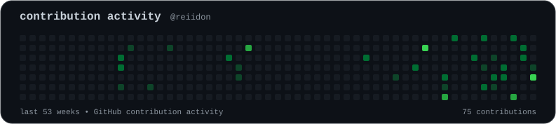

<!-- ========================= -->
<!--        HEADER             -->
<!-- ========================= -->

<div align="center">

# Hey, I'm Shins 👋

### AI Developer • Python Developer • Builder

<br>



</div>


<!-- ========================= -->
<!--      MAIN VISUALS         -->
<!-- ========================= -->

<br>

<table>
<tr>

<td width="42%" valign="top">



</td>

<td width="58%" valign="top">



</td>

</tr>
</table>


<!-- ========================= -->
<!--        ABOUT ME           -->
<!-- ========================= -->

<br>

## About Me

```text
$ whoami

Shins
AI Developer
Python Developer
Computer Science Student

I build AI-powered applications and enjoy turning ideas
into real-world software.
```

<table>
<tr>

<td width="50%" valign="top">

### 🔭 Currently Building

```text
> AI-powered applications
> RAG systems
> Agentic AI workflows
> Full-stack projects
```

</td>

<td width="50%" valign="top">

### 🧠 Interested In

```text
> Large Language Models
> Computer Vision
> AI Agents
> Automation
```

</td>

</tr>
</table>


<!-- ========================= -->
<!--       TECH STACK          -->
<!-- ========================= -->

<br>

## Tech Stack

<div align="center">


</div>

<br>

```text
AI / ML
├── LLMs
├── RAG
├── Agentic AI
└── Computer Vision

Backend
├── Python
├── FastAPI
├── Flask
└── REST APIs

Frontend
├── React
├── JavaScript
├── HTML
└── CSS
```


<!-- ========================= -->
<!--    FEATURED PROJECTS      -->
<!-- ========================= -->

<br>

## Featured Projects

<table>
<tr>

<td width="50%" valign="top">

### 🤖 AI Research Agent

```text
AI-powered research system

Features
• Agentic AI
• RAG
• LLMs
• Document processing
• AI workflow design
```

</td>

<td width="50%" valign="top">

### 📄 AI Resume Screening System

```text
AI-powered resume analysis

Features
• Resume parsing
• AI analysis
• Candidate matching
• Document processing
```

</td>

</tr>

<tr>

<td width="50%" valign="top">

### 🧠 LifePilot

```text
Full-stack productivity system

Features
• Authentication
• JWT
• Modern workflows
• AI integration
```

</td>

<td width="50%" valign="top">

### 💬 Local LLM Chatbot

```text
Local AI chatbot system

Features
• Local LLM
• Conversational AI
• Python backend
```

</td>

</tr>
</table>


<!-- ========================= -->
<!--      DEVELOPMENT          -->
<!-- ========================= -->

<br>

## Development

```text
$ git status

On branch main

Working on:
  → AI projects
  → Backend systems
  → LLM applications
  → Real-world software

Status:
  ● learning
  ● building
  ● shipping
```


<!-- ========================= -->
<!--       FOOTER              -->
<!-- ========================= -->

<br>

<div align="center">

```text
$ echo "Thanks for visiting"

Building one project at a time. 🚀
```

</div>